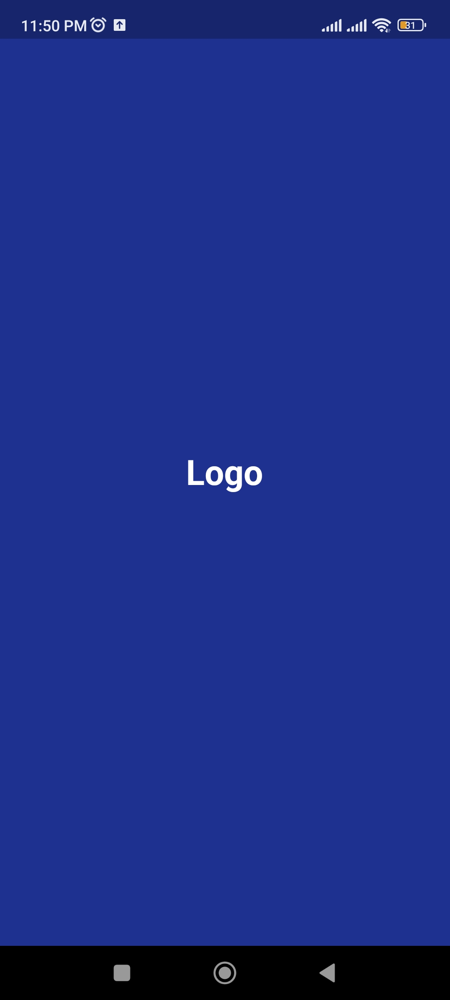
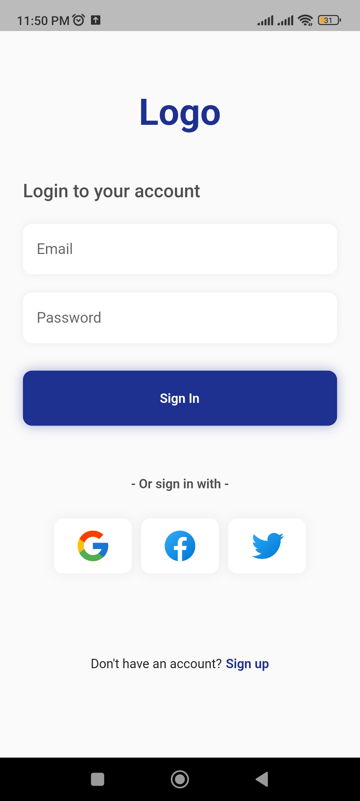

# SplashScreen & Login Page 📱

A beautiful and responsive Flutter application demonstrating a professional user onboarding flow. This project features a custom-timed Splash Screen followed by a modern, validated Login interface.

---

## 📸 Screenshots

| Splash Screen | Login Page |
| :---: | :---: |
|  |  |

---

## ✨ Features

- **Smooth Onboarding:** Professional Splash Screen with logo and branding.
- **Modern UI:** Clean, minimalist Login Page design.
- **Form Validation:** Input validation for Email and Password fields.
- **Responsive Layout:** Works across various screen sizes.
- **Navigation:** Automated transition from Splash to Login after a set duration.

## 🛠️ Tech Stack

- **Framework:** [Flutter](https://flutter.dev/)
- **Language:** [Dart](https://dart.dev/)
- **State Management:** StatefulWidget / setState
- **UI Design:** Material Design 3

## 🚀 Getting Started

### Prerequisites

*   Flutter SDK installed ([Installation Guide](https://docs.flutter.dev/get-started/install))
*   A code editor like VS Code or Android Studio
*   An Emulator or physical device for testing

### Installation & Run

1. **Clone the repository**
```bash
git clone https://github.com/Mohamed-Nafae/SplashScreen_and_LoginPage.git
Navigate to the project folder
```
2. **Navigate to the project folder**
```bash
cd SplashScreen_and_LoginPage
```
3. **Get dependencies**
```bash
flutter pub get
```
4. **Run the app**
```bash
flutter run
```
## 📂 Project Structure
```text
lib/
├── main.dart             # App entry point & Theme data
├── splash_screen.dart    # Logic & UI for the Splash screen
└── login_page.dart       # Logic & UI for the Login screen
assets/
└── images/               # App logos and background assets
```
## ✨ Final Notes
**In the End, I hope you find this project helpful for your Flutter development journey! Feel free to use the code as a template for your own applications.**
